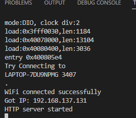
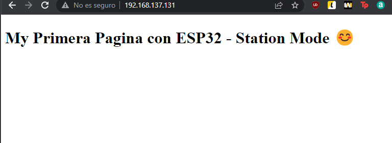

# Practica4

En esta practica vamos a utilizar el modulo wifi que tiene incorporado la ESP32 para crear un servidor web utilizando las libreias "WIFi" y "WEBSERVER"


**CODIGO**

```cpp
#include <WiFi.h>
#include <WebServer.h>
// SSID & Password
const char* ssid = "LAPTOP-7DU9NPMG 3407"; // Enter your SSID here
const char* password = "79437!dA"; //Enter your Password here
WebServer server(80); // Object of WebServer(HTTP port, 80 is defult)


String HTML = "<!DOCTYPE html>\
<html>\
<body>\
<h1>My Primera Pagina con ESP32 - Station Mode &#128522;</h1>\
</body>\
</html>";
// Handle root url (/)
void handle_root() {
server.send(200, "text/html", HTML);
}

void setup() {
Serial.begin(115200);
Serial.println("Try Connecting to ");
Serial.println(ssid);
// Connect to your wi-fi modem
WiFi.begin(ssid, password);
// Check wi-fi is connected to wi-fi network
while (WiFi.status() != WL_CONNECTED) {
delay(1000);
Serial.print(".");
}
Serial.println("");
Serial.println("WiFi connected successfully");
Serial.print("Got IP: ");
Serial.println(WiFi.localIP()); //Show ESP32 IP on serial
server.on("/", handle_root);
server.begin();
Serial.println("HTTP server started");
delay(100);
}


void loop() {
server.handleClient();
}
```

**Declaraciones**

```cpp

const char* ssid = "LAPTOP-7DU9NPMG 3407"; // Enter your SSID here
const char* password = "79437!dA"; //Enter your Password here
WebServer server(80); // Object of WebServer(HTTP port, 80 is defult)


String HTML = "<!DOCTYPE html>\
<html>\
<body>\
<h1>My Primera Pagina con ESP32 - Station Mode &#128522;</h1>\
</body>\
</html>";
// Handle root url (/)
void handle_root() {
server.send(200, "text/html", HTML);
}

```
En las declaraciones vamos a crear dos variables char que utilizaremos para conectarnos a la red Wifi una variable se utilizara para la SSID y la otra para la contraseña

Tambien crearemos un objero Webserver que nos permitira crear una web
Justo despues declararemos una variable String con todo el contenido que mostrara la pagina web en codigo HTML

**SETUP**

```cpp
void setup() {
Serial.begin(115200);
Serial.println("Try Connecting to ");
Serial.println(ssid);
// Connect to your wi-fi modem
WiFi.begin(ssid, password);
// Check wi-fi is connected to wi-fi network
while (WiFi.status() != WL_CONNECTED) {
delay(1000);
Serial.print(".");
}
Serial.println("");
Serial.println("WiFi connected successfully");
Serial.print("Got IP: ");
Serial.println(WiFi.localIP()); //Show ESP32 IP on serial
server.on("/", handle_root);
server.begin();
Serial.println("HTTP server started");
delay(100);
}
```

En esta parte del codigo iniciaremos el Serial y por el mostraremos a que red nos vamos a conectar despues iniciaremos el WIFI con los parametros previamente declarados. Si el wifi no se puede conectar a traves del serial nos mostrara un mensaje de error, pero si este se conecta correctamente nos mostrara por el serial la direccion IP en la cual esta alojada nuestra pagina web.
Finalmente iniciamos el Server

**LOOP**
 
```cpp
void loop() {
server.handleClient();
}
```
En el loop indicaremos al servidor que ya esta disponible para esperar clientes que entren a la pagina web.





